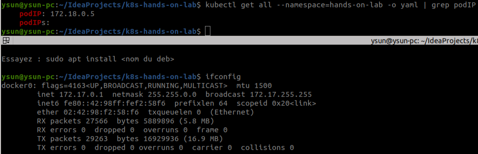

Network in this labo
====================

Architecture
------------

Each POD included in the k8s network should have their unique IP address,
They could communicate each other 
- through different container instances, 
- through different PODs, 
- and through different different hosts. 

The communication between different container instances from inside the same POD:
* They share the same storage and network resources of the POD
* They could communicate each other via 127.0.0.1 which implemented by the Linux Namespace

The communication between different POD from inside the same host:
* Each POD has it's own POD IP which registered in the virtual network card (VETH) of the Docker0 interface,
* All POD IP are bridged to the virtual network card of the Docker0 interface,
* These PODs could communicate each other directly as they belong to the same subnet of the Docker0 interface.

The communication between different POD from different hosts:
* As these PODs belongs to different subnet of different Docker instance,
* Some route rules should be maintained like IP-tables and be broadcast.
* Implemented as Kubernete Plugins as Flannel 

Zookeeper Cluster
---------

Zookeeper: Leader election for Kafka Cluster

Any inbound request from outside the lab namespace should not be handled by this cluster

So no cluster IP need to be associated to this cluster (???)

But From Kafka cluster, each instance Zookeeper should have a fixed and unique private IP (by Service)

As shown as:

Kafka Cluster
-----